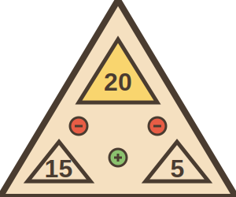

# Tri-Facta

A card game where players need to use their cards to form valid mathematical equations. The game combines strategy, mathematics, and fun!

Play now at: [https://tri.iling.fun/](https://tri.iling.fun/)



## Features

- Mathematical equation validation
- Card-based gameplay mechanics
- Modern and responsive UI
- Docker support for easy deployment
- Automated builds with GitHub Actions

## Quick Start

### Using Docker (Recommended)

1. Pull the latest image from GitHub Container Registry:

```bash
# Login to GitHub Container Registry (first time only)
echo $GITHUB_TOKEN | docker login ghcr.io -u USERNAME --password-stdin

# Pull the image
docker pull ghcr.io/shepherdwind/tri-facta:latest
```

2. Create a `docker-compose.yml` file with the following content:

```yaml
version: '3.8'

services:
  app:
    image: ghcr.io/shepherdwind/tri-facta:latest
    ports:
      - '80:80'
    restart: unless-stopped
```

3. Start the application:

```bash
docker-compose up -d
```

4. Access the game at `http://localhost`

### Manual Installation

1. Clone the repository:

```bash
git clone https://github.com/shepherdwind/tri-facta.git
cd tri-facta
```

2. Install dependencies:

```bash
npm install
```

3. Start the development server:

```bash
npm run dev
```

4. Access the game at `http://localhost:5173`

## Development

### Prerequisites

- Node.js 18 or higher
- npm 9 or higher

### Building for Production

1. Build the application:

```bash
npm run build
```

2. Preview the production build:

```bash
npm run preview
```

### Docker Images

The Docker images are automatically built and published to GitHub Container Registry (ghcr.io) using GitHub Actions. Images are available at:

- Latest version: `ghcr.io/shepherdwind/tri-facta:latest`
- Specific version: `ghcr.io/shepherdwind/tri-facta:v1.0.0` (replace with actual version)
- Branch builds: `ghcr.io/shepherdwind/tri-facta:main` (or other branch names)

#### Automated Builds

The following events trigger automatic Docker image builds:

- Push to main branch
- Creation of version tags (e.g., v1.0.0)
- Pull requests to main branch

#### Manual Build (Local Development)

To build and push a new Docker image locally:

```bash
# Build and push latest version
./build.sh

# Build and push specific version
./build.sh v1.0.0
```

#### Pulling Images

To pull a specific version of the image:

```bash
# Pull using the pull script
./pull.sh

# Or manually pull
docker pull ghcr.io/shepherdwind/tri-facta:latest
```

## Game Rules

1. Each player starts with a set of cards
2. Players take turns to play cards
3. Cards must form valid mathematical equations
4. The first player to use all their cards wins

## Contributing

Contributions are welcome! Please feel free to submit a Pull Request.

## License

This project is licensed under the MIT License - see the LICENSE file for details.
